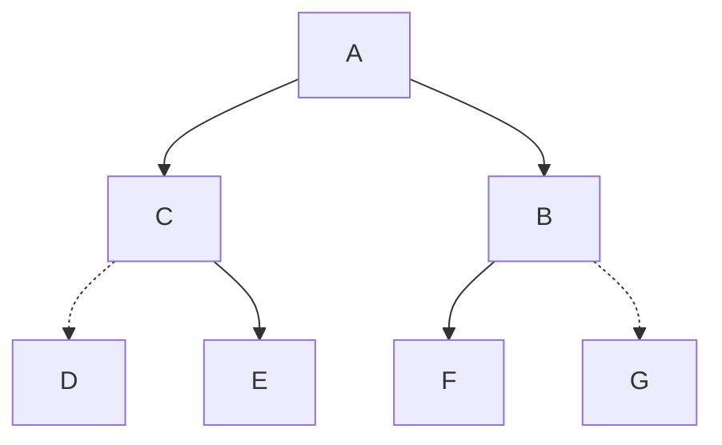
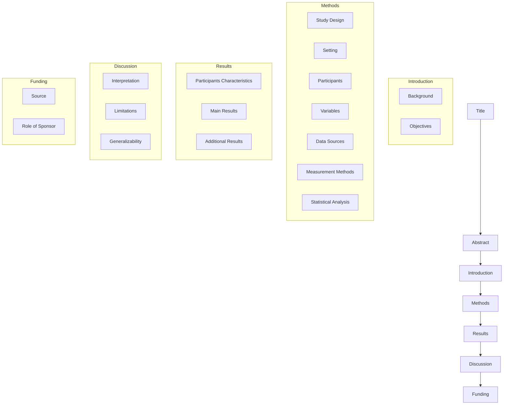

```mermaid
graph TD
  A --> C
  A --> B
  C -.-> D
  C --> E
B --> F
  B -.-> G
```

```mermaid
graph TD
    A[Title] --> B[Abstract]
    B --> C[Introduction]
    C --> D[Methods]
    D --> E[Results]
    E --> F[Discussion]
    F --> G[Funding]

    subgraph Introduction
        I1[Background]
        I2[Objectives]
    end

    subgraph Methods
        M1[Study Design]
        M2[Setting]
        M3[Participants]
        M4[Variables]
        M5[Data Sources]
        M6[Measurement Methods]
        M7[Statistical Analysis]
    end

    subgraph Results
        R1[Participants Characteristics]
        R2[Main Results]
        R3[Additional Results]
    end

    subgraph Discussion
        D1[Interpretation]
        D2[Limitations]
        D3[Generalizability]
    end

    subgraph Funding
        F1[Source]
        F2[Role of Sponsor]
    end
```
