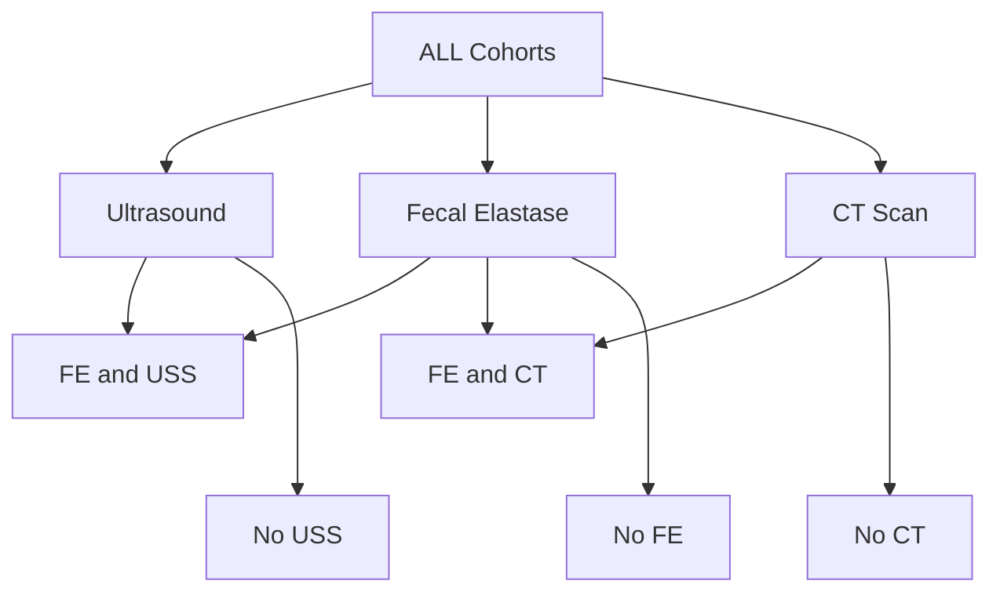
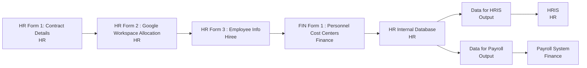
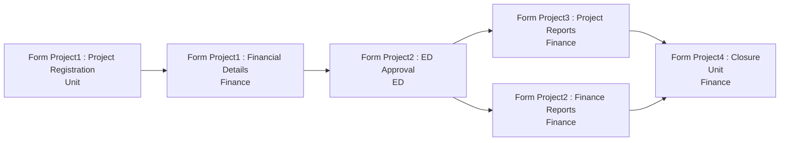
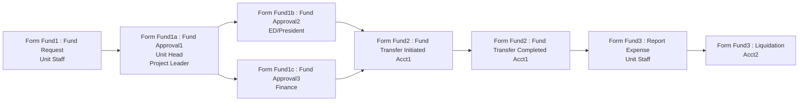
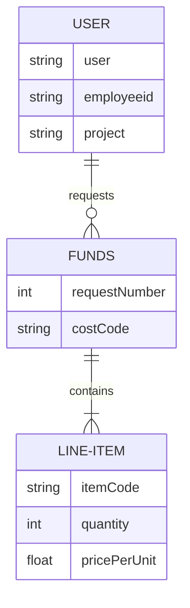
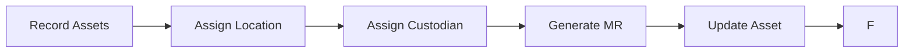

**Participant Diagram**
*All Cohorts*

**People Workflow**

*Contract duration: This can be extended or a new contract is entered.  The revision can be in Form 1.*

**Projects Workflow**

*Project duration: This can be extended or a new contract is entered.  The revision can be in Form 1.*

**Funds Workflow**

*ER Diagram Funds*

**Workflow for Inventory**

